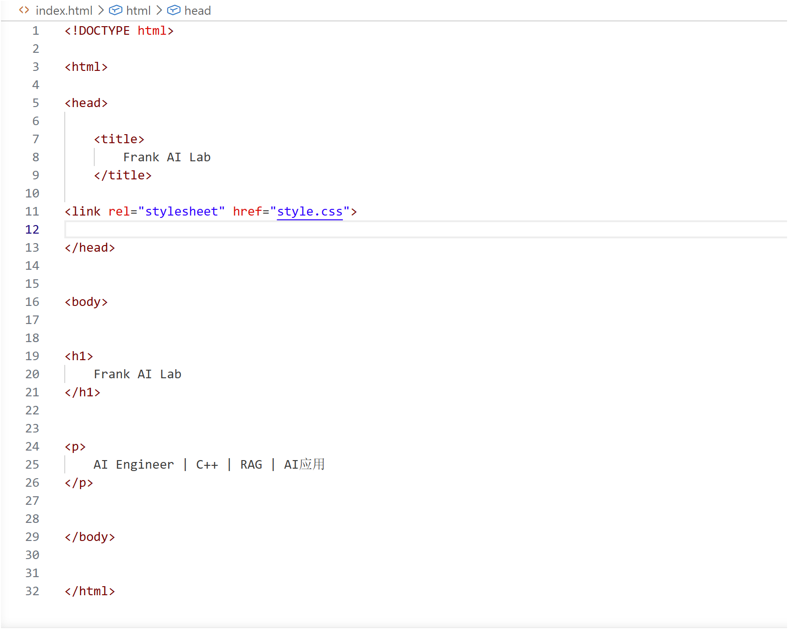
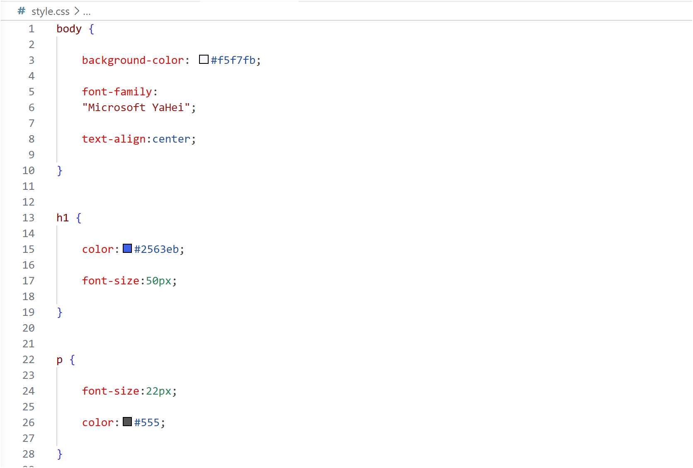
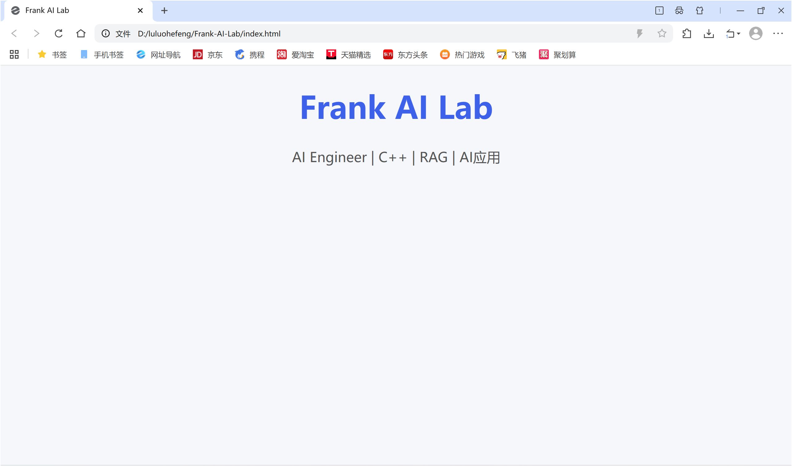
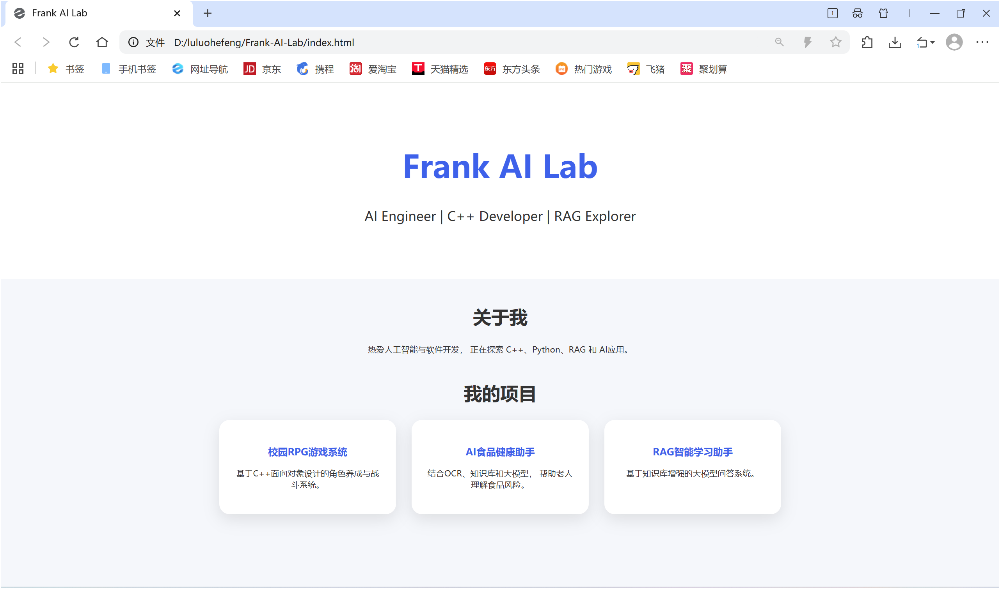

# 学习建立一个网站

## 我希望你最后得到的不是“会跟着教程部署一个网站”，而是真的理解一个网站为什么能运行。

  
✳️ 目录

- TOC
{:toc}

---

## 明确目标

我们做：Frank AI Lab
> 个人 AI 工程主页。

建立这样的文件夹  D:\luluohefeng\Frank-AI-Lab

## 第一步：HTML（结构）+CSS（样式）

在Frank-AI-Lab文件夹内建立： index.html文件 + style.css文件 + image文件夹。

index.html = 定义对象和结构（像 C++ 的类结构）
> 只管创造，不管美丑

style.css = 控制外观（像给对象设置属性）
> 只管美化，不管功能
CSS负责：颜色、大小、位置、间距、动画、布局

image文件夹 = 存储图片文件的文件夹

> 这是index.html的内容：

> 这是style.css的内容：

回到文件资源管理器，点击index.html文件，即可在浏览器中打开。

得到这样的网站：

我小小修改了一下index.html文件 + style.css文件，得到这样的网站：

## 须知

HTML(结构) -> CSS(样式) -> JavaScript(行为) -> 浏览器显示的网站

HTML(创造一个按钮) -> CSS(美化这个按钮) -> JavaScript(实现点击按钮后发生的事情) -> 浏览器显示的网站

- div是容器，是装汉堡的纸袋子（属于HTML）

浏览器看到的是

   里面装了一些东西

有点像C++的类，但是没有方法。

- class 是标签，是汉堡纸袋子上的取餐号。

取餐号是让你找的自己的汉堡，class 是让 CSS 找到它的标签。

- flex 是布局，控制盒子里面东西怎么排列（属于CSS）

